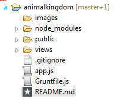
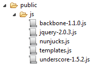

animalkingdom
=============
A small app to (attempt to!) help beginners (like me!) learn Backbone.js,
templating, and more!

# Getting Started

Let me preface this tutorial by explaining that I am by no means an expert on this subject.  Relatively speaking, I am a beginner, and I write this in the hopes of inspiring other beginners, 
and hopefully being able to clear up some confusion that I also encountered through learning some of these concepts.

This tutorial assumes that you have the following installed on your machine:

1. **Nodejs** [http://nodejs.org/](http://nodejs.org/)

2. **CouchDB** [http://couchdb.apache.org/](http://couchdb.apache.org/)

3. **Grunt** [http://gruntjs.com/](http://gruntjs.com/)

And we will be using the following as well:

4. **Backbone** [http://backbonejs.org/](http://backbonejs.org/)

5. **Express** [http://expressjs.com/](http://expressjs.com/)

6. **Nano** - A node module that allows for easy CouchDB usage [https://github.com/dscape/nano](https://github.com/dscape/nano)

7. **Nunjucks** - For templating [http://mozilla.github.io/nunjucks/](http://mozilla.github.io/nunjucks/)


## Next Steps

Once you have the first two items on the list installed, we can move on!

Lots of the tutorials I found on Backbone were slightly confusing to me, because 
all of the code is contained on one page.  For me, at least, that gets slightly
overwhelming, and I found that when I broke out the pieces into separate files,
things became less unwieldy.

So, in order to combat this problem, I separated most of the pieces of the puzzle.
My directory structure looks like this:



`node_modules` should be self-evident, and anyone who has worked with express before
might be familiar with the `public` and `views` folders.  In a nutshell, `public` is going
to house most of everything we're going to be using, which will be mostly js files.
the `views` folder will be home to anything express needs to render, which in our case
is going to be one file (index.html).

## app.js

Let's take a look at app.js.

```js
var async = require('async');
var bodyParser = require('body-parser');
var express = require('express');
var nano = require('nano')('http://localhost:5984');
var nunjucks = require('nunjucks');

var app = express();
app.use(express.static(__dirname + '/public'));
app.use(bodyParser.json());

nunjucks.configure('views', {
  express: app
});

//Creates a new db called animals, silently fails if it exists
nano.db.create('animals');
```

So here we're just declaring our requirements.  Anyone who has used node and express before should
recognize most of this.  In new versions of express, the bodyparser is now a separate module,
and we account for it above with `app.use(bodyParser.json())`.  In this tutorial, I assume that
we'll just be using a standard local couchdb installation, which by default is hosted on 
localhost:5984.  Nano connects to that on line 4.  And lastly, we configure nunjucks to look for
templates in the `/views` folder.  Really, we just need it to find index.html.  The other files 
in `/views/templates` are going to be precompiled to a js file.  Let's do that now.

## /js
Let's take a look inside `/public/js`.    



Here we are housing all of our browser-specific js files, including backbone, jquery, underscore
(backbone dependency), nunjucks, and templates.js (our precompiled templates).

## Precompile our templates
So in order to precompile our templates, I take advantage of a module called grunt-nunjucks
[https://github.com/jlongster/grunt-nunjucks](https://github.com/jlongster/grunt-nunjucks).

If you look inside `gruntfile.js`, you should see a pretty minimal file.  

```js
grunt.initConfig({
  nunjucks: {
    precompile: {
      src: './views/templates/*', //our templates to precompile
      dest: './public/js/templates.js' //our precompiled templates
    },
    options: {
      name: function (filename) {
        return path.basename(filename, '.html'); //strips the filename of .html, leaving us with a pretty template name to use later
      }
    }
  }
});
```

Then, on the command line, you should just be able to type in `grunt` and it should compile nicely.

## index.html
Before we fire up the app, let's take a look at `/views/index.html`.  There's really not much
to it!  We just have some lines of included scripts, and the body is just a few empty divs,
ready to be populated.

You should be aware of a file we're including called `./init.js`.  It is creating a global object
named "AK" (animal kingdom), where we will house our backbone.

**Note the order of js includes here**.  Our init file must be included before our backbone models, 
which must be included before our backbone views, so on and so forth.

## models/Animal.js
Ok!  Backbone time.  In our simple example, we're going to be creating and saving animals.
So, using our global `AK.model`, we add an Animal model.

```js
AK.model.Animal = Backbone.Model.extend({
  defaults: {
    legs: 4,
    rabid: false,
    lives: 1
  },
  urlRoot: '/animal/'
});
```

So, we created a model for Animal.  I threw some arbitrary defaults on it (4 legs, 1 life, and not rabid).
Backbone allows us to set up a urlRoot here, which will magically call certain endpoints
when we perform actions on the model.  For example, when we `save` our model, it will call a POST 
to the urlRoot.

## Views

We could put all of our views inside one file, but I find it easier to separate them, to avoid
dimpi-size (it's only a quarter..and look at how much more you get) files.  Let's take a look at them.

## main.js

This is the main view.  We name it on our AK global and then just extend Backbone.View.  If you 
notice, we are working with the element '#main', which is the id of our center div in index.html.
Stands to reason that we will eventually 'render' something to this div, which is what the `render`
function does here.  

If you remember from earlier, we precompiled the templates located in `/views/templates`, and
created the file `/public/js/templates.js`.   Our grunt task shortened the names of those 
precompiled templates, and that's what we're referencing with
 
`var html = nunjucks.render('main');`

Most of the rest of that file should look familiar to those that have experience with jquery.
Let's just quickly take a look at what happens when we submit our form (the onFormSubmit function):

```js
  onFormSubmit: function (e) {
    var me = this;
    e.preventDefault();
    var formData = this.serializeObject($(e.currentTarget));
    formData.rabid = formData.rabid ? true : false;
    
    //reset our defaults if the form left them blank
    if (formData.lives === ''){
      formData.lives = 1;
    }
  
    if (formData.legs === ''){
      formData.legs = 4;
    }
    
    //create a new animal
    var newAnimal = new AK.model.Animal();
    newAnimal.save(formData, {
      success: function (model, response, options) {
        model.attributes._id = model.attributes.id;
        bootstrap.animals.push(model.attributes);
        me.reset();
        Backbone.history.loadUrl('');
      }
    });
  },
```

Firstly, we're preventing the submit button from defaulting.  Then we are taking the form data
and running it through the serializer function that is included in the main.js file.  If the form
fields on our defaults are blank, we're setting them back, and then we create a new model and save
it.  The save function gets an optional callback, which we'll use here to set our model's _id 
field (which is what couchdb uses).  We then call the main.js function "reset" which resets our
form.  The last bit there essentially refreshes the page, which we need in order to see our
added animal on the right.

## details.js

This file is pretty simple.  When we call render(id), we pass in an id along, and then call
GET /animal/id.  With the data returned from that route, we populate the template "details",
and then populate the div with id "details".

## createdanimals.js

This file is also pretty simple.  When we call render(), we populate the template named 
"createdanimals" and then populate the div with the id "createdanimals".  Note that the data
we pass to it is the bootstrapped "animals" from index.html.


